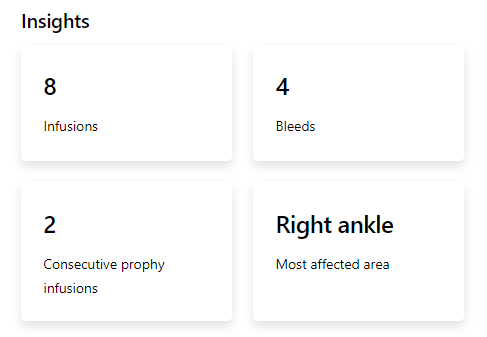
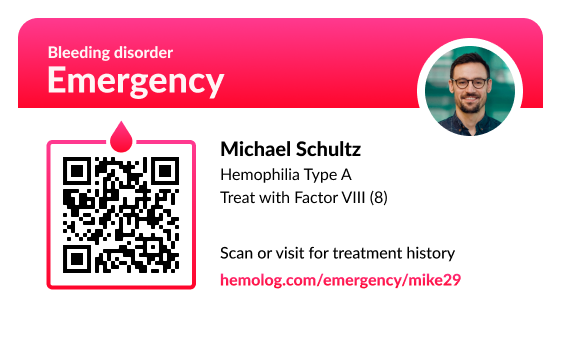

A rebirth of my popular medication tracking app for people living with hemophilia. Available for free at hemolog.com

- Free to use
- Not sponsored by any person or company
- Open source

Hemolog is free but if you'd like to [Donate](https://github.com/sponsors/michaelwschultz), that would be awesome.

## Features

### Insights

Stats are something that I always wanted to be apart of Hemolog, and now they're finally here.

These insights are calculated as you add more data. Filters will allow you to choose different time frames for viewing your data down the road giving you the best most comprehensive view into your treatment history ever. I've chosen a few stats that are interesting for me. If you have thoughts on what you would like to see just let me know.



### Emergency Card

Allows emergency personel to scan or visit the link written on your emergency card to quickly get all the crutial information they need.



Create an account and fill out the profile before printing yours out today.

## History

Hemolog was the first iPhone app available for hemophiliacs back in 2011. It has since been removed from the App Store.
I initially designed Hemolog for myself. I was in college at the time and had been building websites and web apps for friends and family, along with the odd job here and there.

Hemolog ment the world to me and I'm glad it was able to serve people well for the 4 years it was on the App Store. But this year (2020), I decided to take another crack at it. The first version never really lived up to what it was suppose to be. The most important part of having data in a digital format is the ability to quickly gain insights from it. The first version didn't have any built in analytics or stats. This time around, I'm made that the number one priority.

I hope you find Hemolog useful and friendly to use. Or, if you don't have hemophilia, perhaps just a project that's interesting to you in some way.

## Developers

### Getting Started

You'll need Node and Yarn installed before you can run the server. Check the package.json for corresponding version numbers.

You'll also need your own Firebase instance. You can sign up for free at [firebase.google.com](https://firebase.google.com/).

Once you have your database credentials you'll need to add them to a local `.env` file.

```
NEXT_PUBLIC_FIREBASE_PROJECT_ID=""
NEXT_PUBLIC_FIREBASE_DATABASE_URL=""
NEXT_PUBLIC_FIREBASE_AUTH_DOMAIN=""
NEXT_PUBLIC_FIREBASE_PUBLIC_API_KEY=""
FIREBASE_CLIENT_EMAIL=""
FIREBASE_PRIVATE_KEY=""
```

Then run the development server.

```bash
yarn dev
```

Open [http://localhost:3000](http://localhost:3000) with your browser to see the result.

You can start editing the page by modifying `pages/index.tsx`. The page auto-updates as you edit the file.

### Learn More about Next.js

To learn more about Next.js, take a look at the following resources:

- [Next.js Documentation](https://nextjs.org/docs) - learn about Next.js features and API.
- [Learn Next.js](https://nextjs.org/learn) - an interactive Next.js tutorial.

### Deployed on Vercel (you can do the same)

The easiest way to deploy Hemolog is to use the [Vercel Platform](https://vercel.com/import?utm_medium=default-template&filter=next.js&utm_source=create-next-app&utm_campaign=create-next-app-readme) from the creators of Next.js.
